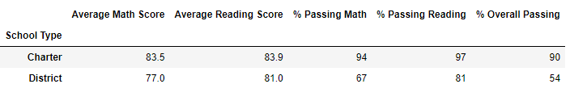

# School District Analysis

## Overview of the School District Analysis

### Purpose

The purpose of this project is to prepare all standardized test data for analysis, reporting, and presentation to provide insights about performance trends and patterns. This project analyzes data on student funding, students' standardized test scores, and showcases trends in school performance.  

Previously, the data showed that the passing percentage of students in Thomas High School were above average, especially those in the 9th grade. It had been discovered however, that 9th grade test scores had probably been tampered with and inflated. This project aims to correct this error by replacing the test scores for 9th graders at Thomas High School and replacing them with NaNs.

## Results 

### Results of School District Analysis
- How is the district summary affected?

As shown in the images below, we can conclude that the changes do not have a significant effect on the overall district since it was only one grade from one school that had the issue.
#### Original District Summary
  

#### Updated District Summary
  

- How is the school summary affected?

The overall passing percentage of Thomas High School decreased from approximately 90.94% to 90.63%.

#### Original School Summary
  

#### Updated School Summary
  
- How does replacing the ninth graders’ math and reading scores affect Thomas High School’s performance relative to the other schools?  

Thomas High School is shown to have a drop in performance but when compared to other schools it does not have a huge impact in its standings, since it is still ranked number two among the top 5 schools ranked in the district.

- How does replacing the ninth-grade scores affect the following:  

    - Math and reading scores by grade  

    The data shows that the overall passing percentage for Thomas High School dropped by 65%. Since it was only the 9th graders whose tests scores had to be edited, 10th - 12th grade scores are unaffected. 

    - Scores by school spending  

     

    - Scores by school size

    

    - Scores by school type

    

Thomas High School is a charter school with 1635 students and a per student budget of $638. It is a medium-sized chartered school in the $630 - $644 spending range. Due to the academic dishonesty displayed by its ninth graders, it brings down passing reading and math scores for the those three categories of schools.

## Summary

There are several changes in the updated school district analysis after reading and math scores for the ninth grade at Thomas High School have been replaced with NaNs. First of all, the overall passing percentage of its students has decreased. Second, there is a decrease in the overall passing rate of medium-sized schools. Thirdly, compared to district schools, the chartered schools category has decreased in its performance. Finally, the $630 - $644 spending range category has overall decreased in passing percentages.  

